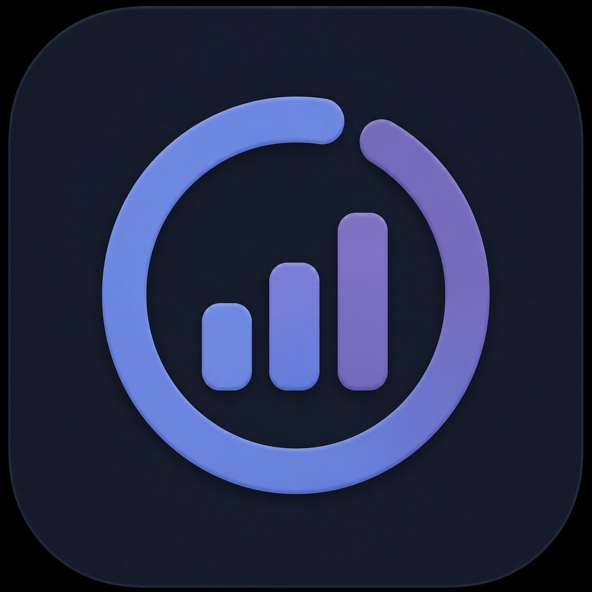
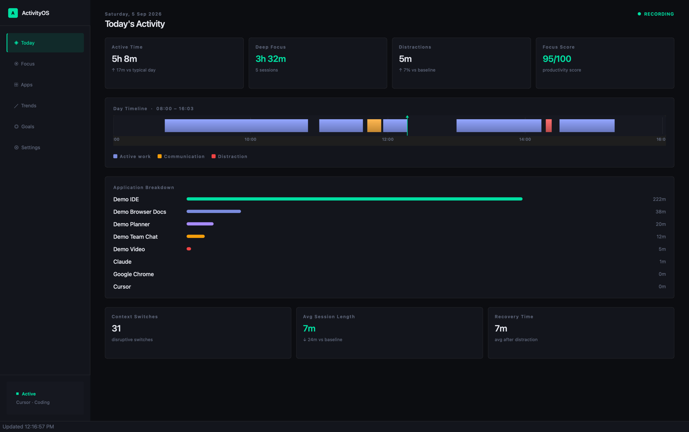
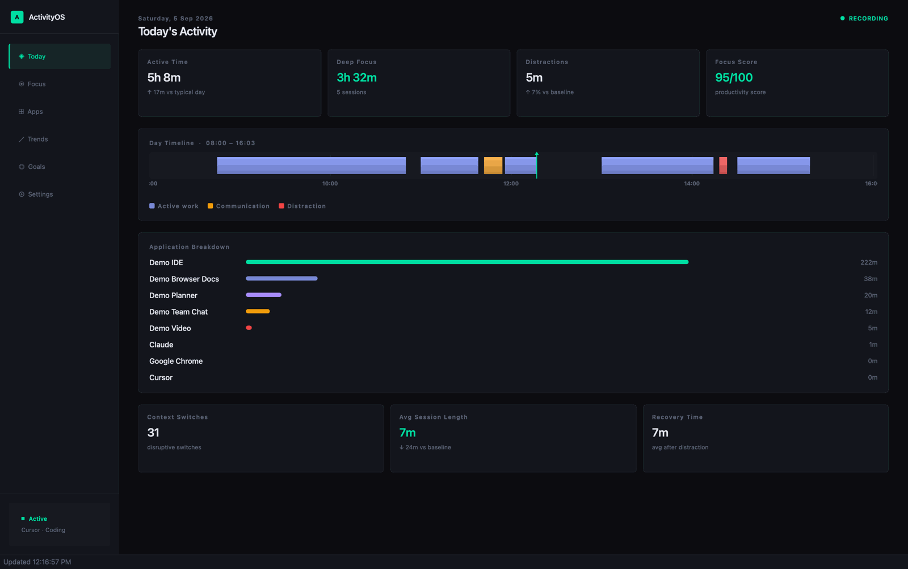

# ActivityOS

[](https://github.com/eyaghmour07/ActivityOS/actions/workflows/ci.yml)



**Local-first desktop analytics for how you actually spend your workday.**

ActivityOS tracks which applications you use and turns that into explainable focus metrics — sessions, distractions, baselines, and goals. Everything stays on your machine. No accounts, no cloud, no keylogging, no screenshots.

Built with **C++20**, **Qt 6**, and **SQLite**.





| [Focus](docs/screenshots/focus.png) | [Trends](docs/screenshots/trends.png) |
| --- | --- |
| [Goals](docs/screenshots/goals.png) | [Settings](docs/screenshots/settings.png) |

## Why it exists

Most productivity tools either invade privacy or give you an opaque score. ActivityOS is for personal reflection: it records **foreground app + idle time** only, stores a SQLite file you control, and computes scores you can audit.

## Features

- Native foreground-app and idle detection on macOS, Windows, and Linux/X11
- Session, focus, and context-switch detection with a hoverable day timeline
- Browser-aware classification (work/study sites vs streaming) plus editable rules
- 14-day baselines, weekly trends, and an explainable productivity score
- Goals, experiments, pause/export/delete — data never leaves the device

## Design decisions

I chose **C++20 and Qt 6** because this is a tray-resident tracker that should stay cheap while you work in other apps. A web stack would have been faster to skin, but it would also mean a Chromium process sitting in the dock all day. Qt gives one native UI and system-tray story across macOS, Windows, and Linux, talks cleanly to SQLite, and lets the OS adapters stay in the language the platform APIs already speak (Objective-C++ on macOS, Win32, X11).

Scoring is **deterministic on purpose**. There is no model, no embeddings, no “AI insight” layer. Focus blocks, distraction cost, and the 0–100 score are formulas you can read in [`docs/metrics.md`](docs/metrics.md) and step through in tests. That is slower to look magical and faster to trust: if the number is wrong, you can find the branch. An ML classifier would hide the same mistakes behind a confidence score I could not explain in a code review.

The tradeoff I actually hit: **shipping a Qt app on macOS is harder than writing the analytics.** A CMake binary links Homebrew Qt; a `.app` you drag to `/Applications` has to bundle those frameworks or it dies at launch (“quit unexpectedly”) when two Qt copies load. `macdeployqt` plus ad-hoc codesign is the path that works. A downloaded DMG still gets Gatekeeper-quarantined, so v0.1 ships as source plus an install script rather than a fake one-click installer. That is the honest cost of picking native C++ over Electron.

## Performance

Measured on an Apple Silicon Mac, dashboard open, tracker running (`2026-09-05`):

| Metric | Measured |
| --- | --- |
| Sampling interval | **5 s** foreground poll · **60 s** heartbeat · **30 s** UI refresh |
| Idle threshold | **5 min** of OS-reported idle before a session closes |
| RSS | **164–193 MiB** (8 samples over 20 s; one jump when the window woke) |
| CPU | **~0%** between polls · **6.2%** brief spike · **0.8%** average over the same window |
| Database | **276 KiB** main file after 3 days of live use (736 sessions, 975 events) |
| Growth | **~90 KiB/day** on that live window → **~0.6 MiB/week** at the same density |

Demo data adds more sessions (840 sessions / 13-day span in this copy) and a WAL file until SQLite checkpoints; the weekly figure above is from live tracking only, not the synthetic load.

## Status

| Platform | Status |
|----------|--------|
| **macOS (Apple Silicon)** | Primary target — build via the install script |
| Windows | Builds and tracks; packaging less polished |
| Linux/X11 | Supported |
| Linux/Wayland | Limited — compositors often block global window inspection |

v0.1 is a **source release**. Build it on the machine that will run it; that avoids Gatekeeper quarantine.

## Quick start (macOS)

```sh
brew install cmake qt
git clone https://github.com/eyaghmour07/ActivityOS.git
cd ActivityOS
chmod +x scripts/install_macos.sh
./scripts/install_macos.sh
```

See [docs/share-with-a-friend.md](docs/share-with-a-friend.md) to update or share a copy.

## Build and test

```sh
cmake --preset default
cmake --build --preset default
ctest --preset default
```

CI runs the same four suites (**analytics**, **storage**, **activity source**, **services**) on macOS, Ubuntu, and Windows. They currently pass in **0.8 s** locally. There is no line-coverage gate yet; the suites cover classification (including VS Code / Chrome / lock-screen), sessionization, migrations, and dashboard aggregation.

### Ubuntu/Debian

```sh
sudo apt install cmake g++ qt6-base-dev libsqlite3-dev libx11-dev libxss-dev
```

### Windows

Install Qt 6, CMake, Visual Studio 2022 (Desktop C++), and SQLite. Set `CMAKE_PREFIX_PATH` if needed.

## Privacy

- **Recorded:** app names, transitions, idle duration, derived metrics, your rules/goals
- **Not recorded:** keystrokes, screenshots, webcam, file/page contents, cloud sync
- Window titles are inspected only for classification and are **not stored by default**
- Lock-screen / `loginwindow` is treated as idle, not an app

Details: [docs/privacy.md](docs/privacy.md) · formulas: [docs/metrics.md](docs/metrics.md)

Data lives at:

- macOS: `~/Library/Application Support/ActivityOS/ActivityOS/activityos.db`
- Windows: `%LOCALAPPDATA%/ActivityOS/ActivityOS/activityos.db`
- Linux: `~/.local/share/ActivityOS/ActivityOS/activityos.db`

## Architecture

```text
Native OS adapter
  → Tracker service
  → SQLite event/session store
  → Deterministic analytics engine
  → Qt desktop dashboard
```

- [`include/activityos/activity_source.hpp`](include/activityos/activity_source.hpp) — native tracking contract
- [`include/activityos/storage.hpp`](include/activityos/storage.hpp) — SQLite + privacy ops
- [`include/activityos/analytics.hpp`](include/activityos/analytics.hpp) — workstyle metrics
- [`include/activityos/services.hpp`](include/activityos/services.hpp) — orchestration
- [`src/app`](src/app) — dashboard, tray, settings, goals

## What I'd do next

- **Signed, notarized macOS install** so friends can skip building Qt. Gatekeeper is the real distribution blocker, not missing features.
- **Wayland** needs a compositor-specific path (or an honest “unsupported” forever). Silent fake data would be worse.
- **Line-coverage + fuzz on the sessionizer** so merge/idle edge cases stay pinned.
- **Windows installer polish** to match the macOS script.

Known limitations today: Linux/Wayland collection is incomplete; DMG/ZIP downloads are not a supported install path; scores are heuristics, not a measure of job performance.

## License

MIT — see [LICENSE](LICENSE).
